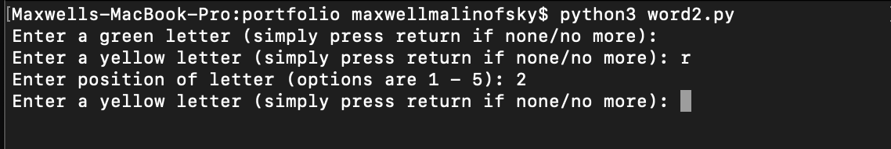
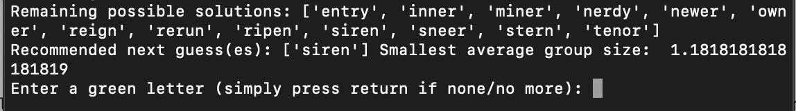
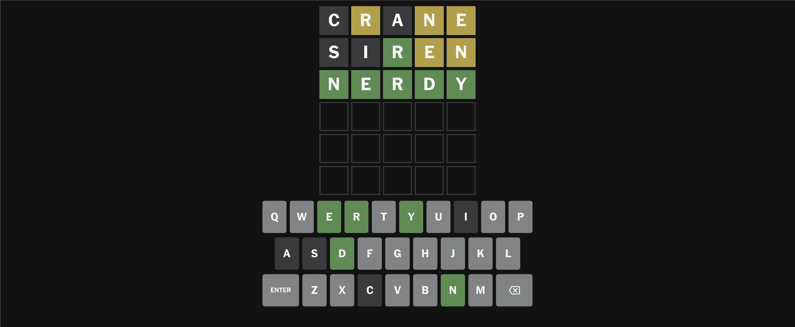
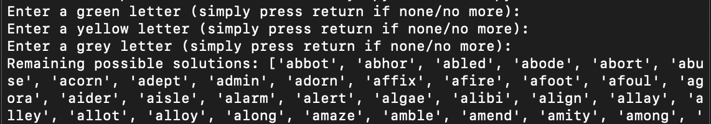

# WordleSolver

This program solves the NYT game Wordle. 


*Wordle from 7/17/24*

## Installation

Use the package manager [pip](https://pip.pypa.io/en/stable/) to install the required packages.

```bash
pip install -r requirements.txt
```

## Using the program

When playing Wordle, start by entering your own first guess into the game. 


*Wordle from 7/18/24*

When you start the program, it begins by prompting you to enter a green letter. In this above example, there are no green letters, so you would press enter, as it instructs.

Next, the program prompts for yellow letters. In this case, there are 3-- we will start with 'r'. The program then prompts for the position. Since the 'r' is in the 2nd position out of 5, you enter '2.'




After you finish entering the yellow letters, then the grey letters (which don't require letter positions to be entered), the program will give you a few pieces of information. It will display the "Remaining possible solutions," and most importantly, "Recommended next best guess(es)." 




In this case, the program recommends "siren," so that is what we will guess next. It also gives a metric called "Smallest average group size," which will be explained in more detail in the "How the program works" section of this README file. 


After entering the corresponding greens, yellows, and greys from the guess "siren," the program presents one remaining word and then terminates.


This means "nerdy" is the answer.




In a thid and final example, if you want the program to recommend the best first guess, you can press "enter" for green, yellow, and grey with 0 entries. 



Using this strategy, on this particular Wordle game (this can potentially change from day to day), the program recommends "parse."


After inputting "parse," the program evaluates 6 different, equally good guesses, so you can choose one at random.


The program would solve on the next guess if you chose "light". Since the "average group size" was >1, the prorgram was not guaranteed to get the answer on the third guess, however (again, more on this soon).


*Wordle from 7/22/24*

## How the program works

The program begins by importing a list of all possible Wordle answers from a github repository, as well as using BeautifulSoup and regular expressions to import and parse a list of all past Wordle answers from a website. 


It then uses list comprehension to subtract all past answers from all possible answers, since Wordle doesn't repeat answers (the program theoretically might need to be updated once all answers have been used). 

The program continues to use list comprehension to subtract all impossible answers based on green, yellow, and grey letters. 


Next, the program needs to store all 


