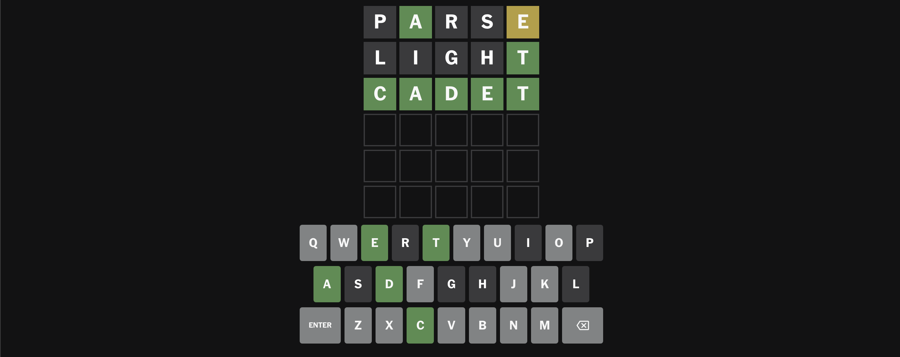
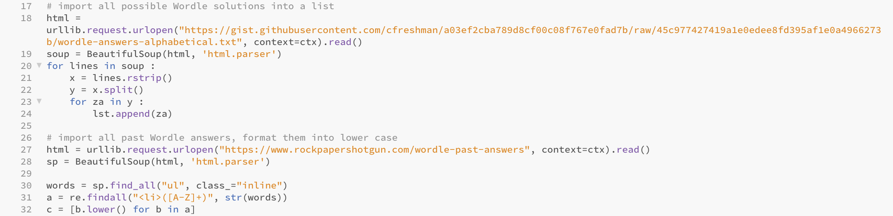
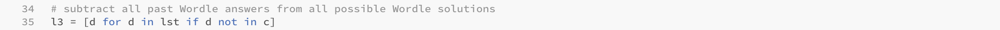
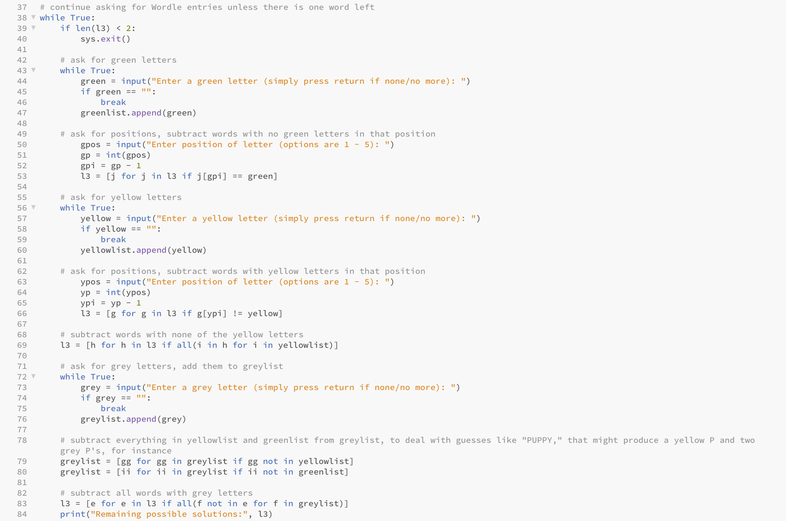
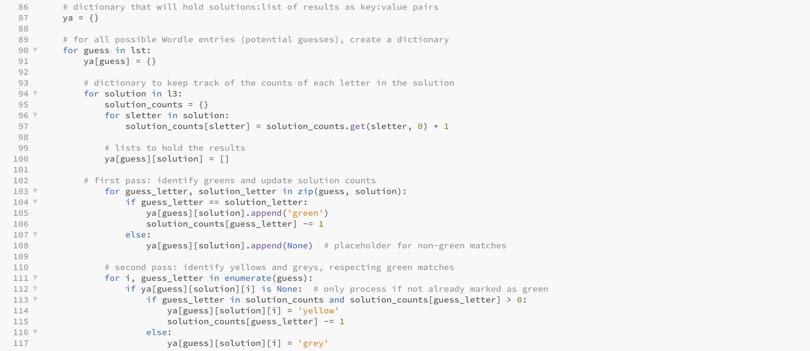
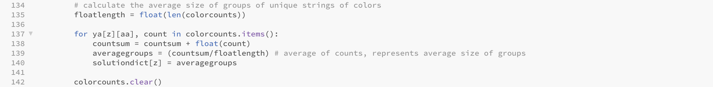
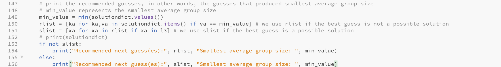
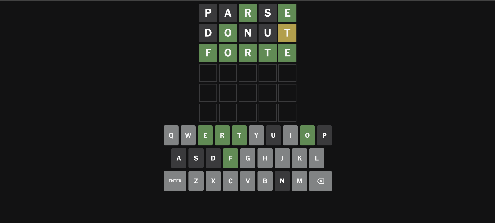

# WordleSolver

This program solves the NYT game Wordle. 


*Wordle from 7/17/24*

## Installation

Use the package manager [pip](https://pip.pypa.io/en/stable/) to install the required packages.

```bash
pip install -r requirements.txt
```

## Using the program

When playing Wordle, start by entering your own first guess into the game. 


When you start the program, it begins by prompting you to enter a green letter. In this above example, there are no green letters, so you would press enter, as it instructs.

Next, the program prompts for yellow letters. In this case, there are 3-- we will start with 'r'. The program then prompts for the position. Since the 'r' is in the 2nd position out of 5, you enter '2.'


After you finish entering the yellow letters, and then entering the grey letters (which don't require letter positions to be entered), the program will give you a few pieces of information. It will display the "Remaining possible solutions," and most importantly, "Recommended next best guess(es)." 


In this case, the program recommends "siren," so that is what we will guess next. It also gives a metric called "Smallest average group size," which will be explained in more detail in the "How the program works" section of this README file. 


After entering the corresponding greens, yellows, and greys from the guess "siren," the program presents one remaining word and then terminates.


This means "nerdy" is the answer.


*Wordle from 7/18/24*

In another example, if you want the program to recommend the best first guess, you can press "enter" for green, yellow, and grey with 0 entries. 


Using this strategy, on this particular day, the program recommends "parse" as the best first guess (this can potentially change from day to day).


After inputting "parse," the program evaluates 6 different, equally good guesses, so you can choose one arbitrarily.


The program would solve on the next guess if you chose "light". Since the "average group size" was >1, it was not guaranteed to get the answer on the third guess, however (again, more on this soon).


*Wordle from 7/22/24*

## How the program works

The program needs to start with a list of all valid Wordle solutions. It begins by scraping a list of all possible Wordle solutions from a github repository, as well as using BeautifulSoup and regular expressions to import and parse a list of all past Wordle solutions from a website. 



It then uses list comprehension to subtract all past solutions from all possible solutions, since Wordle never repeats solutions. 



The program uses list comprehension once again to subtract all impossible solutions based on green, yellow, and grey letters, continuing to prompt the user to enter letters until there is only one Wordle solution left. 



Next, the program needs to recommend guesses. To do this, it must first compare every possible guess to every possible solution, storing the theoretical greys, yellows, and greens that each guess/solution pairing would produce. It is important to check every possible guess, since very often the best guess is not a possible solution.



For every guess, the program must now sort the grey, yellow, greens of those solutions into "groups." For instance, if only 2 solutions for the same guess produce "grey grey yellow grey grey," the program tracks that unique string of colors and stores the count "2."


The program now calculates the average size of those groups of unique strings of colors. The smaller the average size of groups for a guess, the faster Wordle can generally be solved with that particular guess. The most extreme example is an average group size of 1. If all groups (unique strings of colors) have only one possible solution, that means your next guess guarantees solving Wordle on the following guess. 



Here is the code that prints all the guesses with the smallest average group size. The program prioritizes recommending guesses that could be possible solutions, but not at the expense of recommending guesses with smallest average group size. 



In this example, after our first guess "parse," there are only 6 remaining possible solutions.


Just below that, we can see that there are a bunch of potential guesses that will produce an average group size of 1, so we just choose one at random-- and we are guaranteed to solve Wordle in 3.



*Wordle from 7/24/24*


